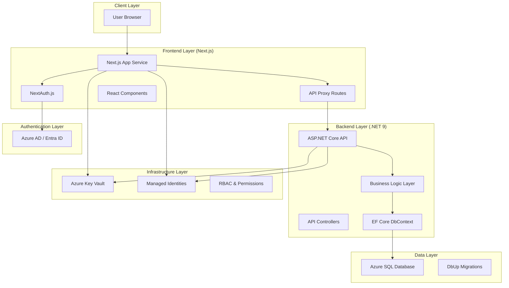
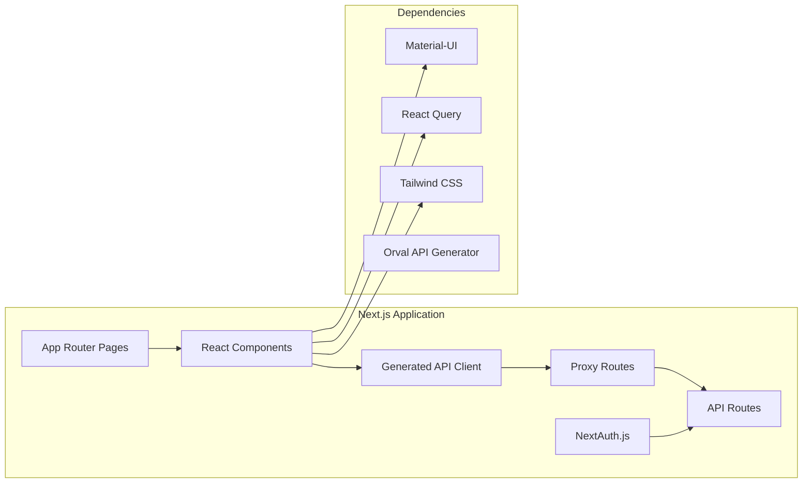
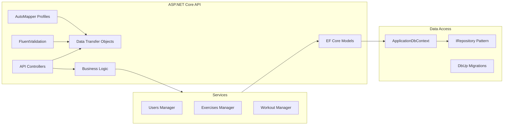
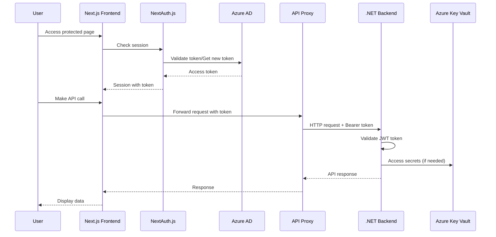
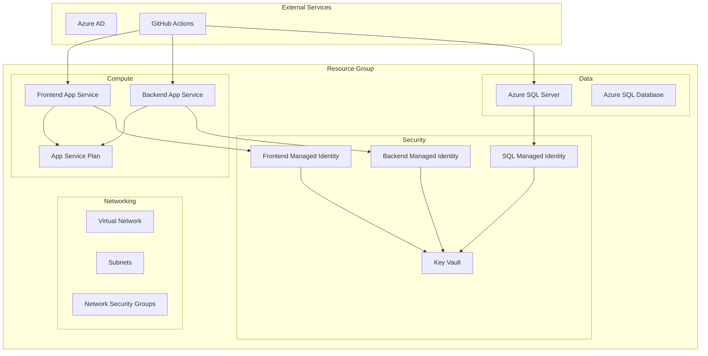
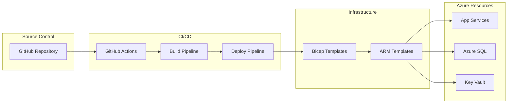

# Hupiukko - System Architecture Diagram

## Overview

Hupiukko is a full-stack fitness application built with Next.js frontend, .NET 9 backend, and Azure infrastructure. The system uses a BFF (Backend for Frontend) pattern with Azure AD authentication.

## High-Level Architecture

## Detailed Component Architecture

### Frontend (Next.js)

### Backend (.NET 9)

## Authentication Flow (BFF Pattern)

## Infrastructure Architecture

### Azure Resources

### Deployment Pipeline

## Security Architecture

### Authentication & Authorization

- **Frontend**: NextAuth.js with Azure AD provider
- **Backend**: JWT Bearer token validation
- **Tokens**: Stored in HTTP-only cookies (secure)
- **Scopes**: `api://{client-id}/user_impersonation`

### Secrets Management

- **Key Vault**: Centralized secrets storage
- **Managed Identities**: Service-to-service authentication
- **RBAC**: Role-based access control
- **Connection Strings**: Stored as Key Vault secrets

### Network Security

- **HTTPS Only**: All endpoints use TLS
- **CORS**: Configured for development/production
- **Firewall Rules**: Azure SQL allows Azure IPs
- **Private Endpoints**: Available for production (cost consideration)

## Data Flow

### API Request Flow

1. **Client Request**: React component calls generated API hook
2. **Proxy Layer**: Next.js API route forwards to backend
3. **Authentication**: Token automatically attached to request
4. **Backend Processing**: JWT validation, business logic execution
5. **Data Access**: Entity Framework Core with SQL Server
6. **Response**: Data returned through proxy to frontend

### Database Operations

1. **Migrations**: DbUp manages schema changes
2. **Connection**: Managed identity authenticates to SQL
3. **Transactions**: EF Core handles data consistency
4. **Validation**: FluentValidation ensures data integrity

## Technology Stack

### Frontend

- **Framework**: Next.js 15 with App Router
- **UI Library**: Material-UI + Tailwind CSS
- **State Management**: React Query (TanStack Query)
- **Authentication**: NextAuth.js v4
- **API Client**: Orval-generated React Query hooks

### Backend

- **Framework**: ASP.NET Core 9
- **ORM**: Entity Framework Core
- **Validation**: FluentValidation
- **Mapping**: AutoMapper
- **Documentation**: Swagger/OpenAPI
- **Authentication**: JWT Bearer tokens

### Infrastructure

- **IaC**: Bicep templates
- **CI/CD**: GitHub Actions
- **Hosting**: Azure App Service (Linux)
- **Database**: Azure SQL Database (Serverless)
- **Secrets**: Azure Key Vault
- **Identity**: Azure AD + Managed Identities

## Development Workflow

### Local Development

1. **Database**: SQL Server in Docker container
2. **Backend**: `dotnet run` on local machine
3. **Frontend**: `npm run dev` with hot reload
4. **API Client**: Generated from running backend

### Deployment

1. **Infrastructure**: Bicep deployment via GitHub Actions
2. **Backend**: Container deployment to App Service
3. **Frontend**: Node.js deployment to App Service
4. **Database**: Migrations run via DbUp
5. **Secrets**: Automatically configured in Key Vault

## Monitoring & Observability

### Logging

- **Frontend**: Next.js built-in logging
- **Backend**: ASP.NET Core logging with structured logs
- **Infrastructure**: Azure Monitor and Application Insights

### Health Checks

- **API Endpoints**: Swagger documentation
- **Database**: Connection health monitoring
- **Authentication**: Token validation logging

## Scalability Considerations

### Current Setup

- **App Service Plan**: F1 (Free tier) - suitable for development
- **Database**: Serverless tier with auto-pause
- **Static Assets**: Served from App Service

### Production Scaling

- **App Service**: Premium plans for better performance
- **Database**: Provisioned capacity for consistent performance
- **CDN**: Azure CDN for static assets
- **Load Balancing**: Application Gateway for multiple instances
- **Monitoring**: Full Application Insights integration
