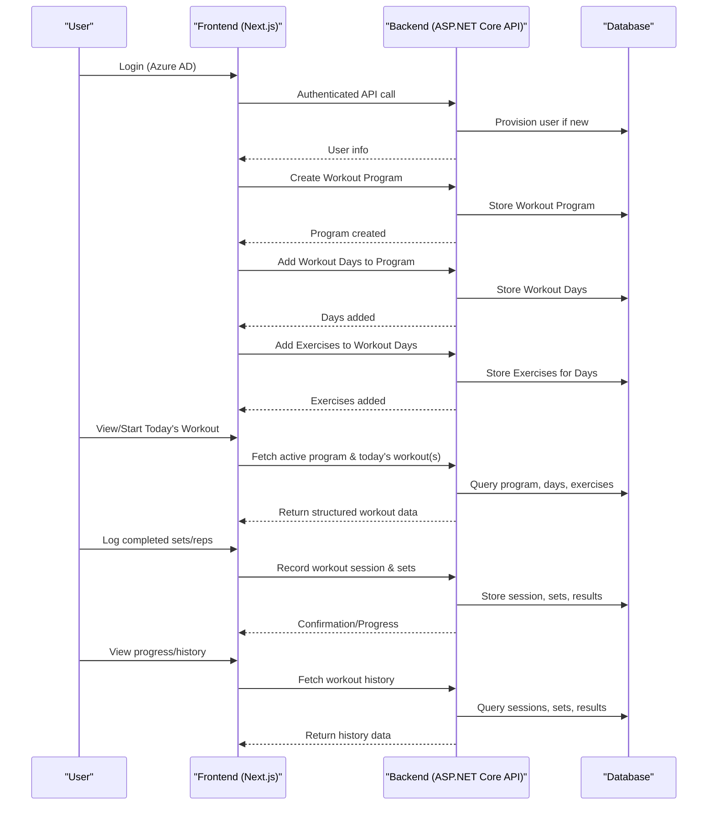
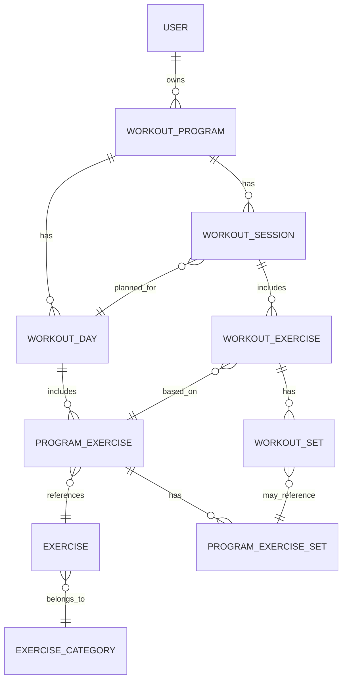

# Workout Program, Workout Day, and Exercise Flow

This document explains the main concepts and flow for how users interact with workout programs, workout days, and exercises in the app.

## Main Concepts

- **Workout Program**: A collection of planned workouts, typically spanning multiple weeks. Users create a program to structure their training.
- **Workout Day**: Represents a specific planned workout within a program (e.g., "Monday - Push Day"). Each program can have multiple workout days, and each day can be scheduled for any day of the week or left flexible.
- **Exercise**: An individual movement or activity (e.g., "Bench Press"). Each workout day contains a list of exercises, each with its own sets, reps, and other parameters.
- **Workout Session**: When a user performs a workout, a session is created, referencing the planned workout day. The session records actual performance (sets, reps, weights, etc.).

## Typical User Flow

1. **User logs in** (via Azure AD; user is provisioned in the database if new).
2. **User creates a Workout Program** (e.g., "5-Day Split").
3. **User adds Workout Days** to the program (e.g., "Monday - Chest", "Tuesday - Back").
4. **User adds Exercises** to each Workout Day (e.g., "Bench Press" on Monday, "Pull-Up" on Tuesday).
5. **On training day, user views today's planned workout** (the app fetches the active program and the relevant workout day(s)).
6. **User logs completed sets/reps** as they perform the workout (a Workout Session is created, referencing the planned Workout Day).
7. **User can view progress/history** (the app fetches past sessions and results).

## Sequence Diagram

Below is a high-level sequence of how the main entities interact during typical usage:

## Entity Relationships

The following describes the main entities and how they relate to each other:

- **User**: Owns one or more Workout Programs and Workout Sessions.
- **WorkoutProgram**: Belongs to a User. Contains multiple WorkoutDays, ProgramExercises, and WorkoutSessions.
- **WorkoutDay** (planned): Represents a specific planned workout within a program (e.g., "Monday - Push Day"). Each WorkoutProgram can have multiple WorkoutDays. Each WorkoutDay contains a list of ProgramExercises (the exercises to be performed on that day). This allows for flexible scheduling, multiple workouts per week, and grouping exercises by day.
- **ProgramExercise**: Belongs to a WorkoutDay (and indirectly to a WorkoutProgram) and references a specific Exercise. Can have multiple ProgramExerciseSets (for set/rep/weight templates).
- **Exercise**: The master list of all possible exercises. Can belong to an ExerciseCategory. Used in many ProgramExercises.
- **ProgramExerciseSet**: Defines the planned sets/reps/weights for a ProgramExercise.
- **WorkoutSession**: Represents a user's actual workout. Belongs to a WorkoutProgram, User, and references the planned WorkoutDay. Contains multiple WorkoutExercises.
- **WorkoutExercise**: Represents a performed exercise in a WorkoutSession. References the planned ProgramExercise. Contains multiple WorkoutSets.
- **WorkoutSet**: Represents a performed set in a WorkoutExercise. May reference the planned ProgramExerciseSet.
- **ExerciseCategory**: Groups Exercises by type (e.g., Push, Pull, Legs).

### Entity Relationship Diagram

This diagram shows the main relationships between users, programs, days, exercises, sessions, and sets, including the planned addition of WorkoutDay for more flexible and organized workout planning.

## Notes
- The structure supports flexible scheduling: users can have multiple workout days per week, and can perform any planned workout on any day.
- The backend enforces authentication for all API calls.
- All API calls are proxied through the Next.js frontend for secure token handling.
- The data model is designed for extensibility (e.g., supporting supersets, circuits, or custom exercise parameters in the future). 